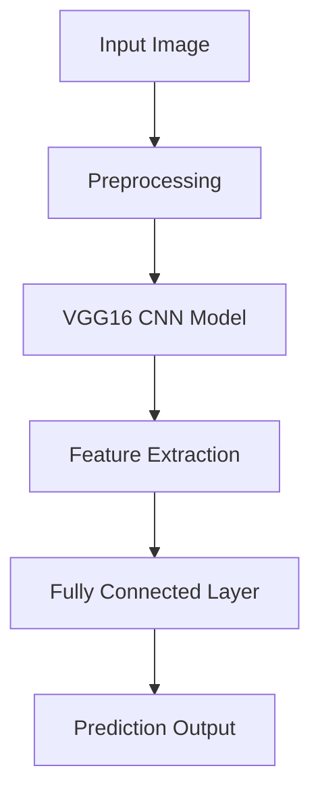

#  Animal Image Classifier using Deep Learning

[](https://www.python.org/)
[](https://www.tensorflow.org/)
[](https://keras.io/)
[]()
[]()

A deep learning-based **Animal Image Classification System** that identifies different animal species from images using **Convolutional Neural Networks (CNN)** and **Transfer Learning (VGG16)**.

This project demonstrates how AI can automatically recognize animals from images and can be applied in **wildlife monitoring, research, and smart detection systems**.

---

##  Architecture



---

##  Key Features

*  Image classification of multiple animal species
*  Deep Learning model using CNN
*  Transfer Learning with VGG16
*  Training & evaluation using Jupyter Notebooks
*  Organized dataset and experiments
*  High accuracy with pretrained models

---

##  Technology Stack

* **Language:** Python 3.10+
* **Deep Learning:** TensorFlow / Keras
* **Model:** VGG16 (Transfer Learning)
* **Tools:** Jupyter Notebook
* **Libraries:** NumPy, Matplotlib, OpenCV

---

##  Project Workflow

1️⃣ **Data Collection**

* Dataset contains multiple animal categories
* Images are labeled and organized

2️⃣ **Data Preprocessing**

* Image resizing and normalization
* Train-validation split

3️⃣ **Model Building**

* Pretrained **VGG16 model** used
* Custom classification layers added

4️⃣ **Training**

* Model trained on labeled dataset
* Performance evaluated using accuracy

5️⃣ **Prediction**

* Input new image
* Model predicts animal class

---

##  Model Insight

* Uses **Transfer Learning** → reduces training time
* CNN extracts image features automatically
* Fully connected layers classify final output
* Suitable for multi-class classification problems

---

##  Installation

```bash id="inst01"
git clone https://github.com/basitsocial-sys/Animal-image-classifier.git
cd Animal-image-classifier
pip install -r requirements.txt
```

---

##  Usage

Run Jupyter Notebook:

```bash id="run01"
jupyter notebook
```

Then open and run:

* `final_notebook.ipynb`
* `I_notebook.ipynb`
* `V_notebook.ipynb`

---

##  Example

Input:
Upload an image of an animal

Output:
Predicted animal class (e.g., Dog , Cat , Horse )

---

##  Project Structure

```id="struct01"
Animal-image-classifier/
│
├── data/                  # Dataset
├── images/                # Sample images
├── experiments/           # Training experiments
├── I_notebook.ipynb       # Initial training
├── V_notebook.ipynb       # Validation
├── final_notebook.ipynb   # Final model
├── bottleneck_fc_model.h5 # Trained model
├── test_file.ipynb        # Testing
├── README.md
```

---

##  Performance

* High accuracy using pretrained CNN
* Efficient feature extraction
* Reduced training time using transfer learning

---

##  Applications

*  Wildlife monitoring systems
*  Camera-based animal detection
*  Environmental research
*  AI-based classification systems

---

##  Future Improvements

* Real-time camera detection
* Web app deployment (Flask / Streamlit)
* Support for more animal classes
* Model optimization and tuning

---

##  requirements.txt

```txt id="req01"
tensorflow
keras
numpy
matplotlib
opencv-python
jupyter
```

---

##  GitHub Description

Deep learning based animal image classifier using CNN and VGG16 transfer learning for multi-class image classification.

---

##  GitHub Topics

machine-learning, deep-learning, cnn, image-classification, tensorflow, keras, computer-vision, animal-classifier

---

##  License

MIT License
